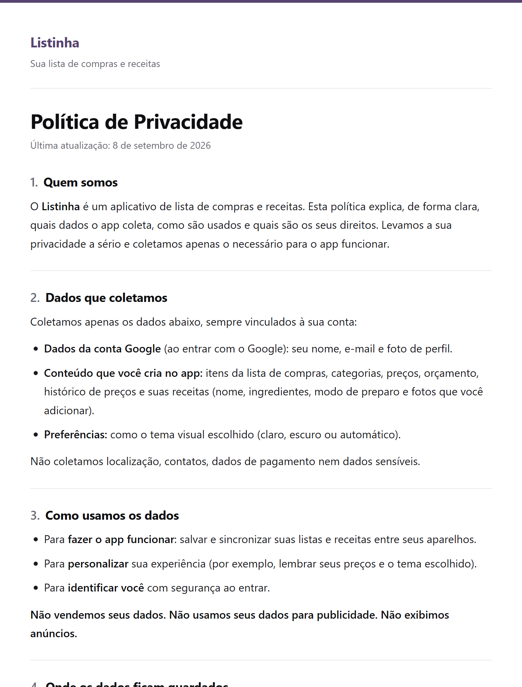

<div align="center">


# Listinha · Política de Privacidade

**A política de privacidade do app Listinha, em linguagem simples.**

Este repositório hospeda a página pública que explica quais dados o app Android **Listinha** coleta, como usa e como você pode excluí-los.

<br />

[](https://danyyks.github.io/listinha-privacidade/)

<br />


</div>

<br />

## Sobre o projeto

O **Listinha** é um app Android de lista de compras e receitas, publicado na Google Play. Apps que tratam dados de usuários precisam de uma **política de privacidade pública**, e é isso que este repositório entrega: uma página simples, sem anúncios e sem rastreadores, que pode ser aberta por qualquer pessoa, direto do navegador.

O texto foi escrito para ser **claro e honesto**, sem juridiquês: diz exatamente o que o app guarda, por que guarda e como apagar tudo com um toque, dentro do próprio app. A página fica no ar pelo **GitHub Pages**, sem servidor nem custo.

<br />

## Tela

<div align="center">



</div>

<br />

## O que a política cobre

- 🪪 **Quem somos** — o que é o Listinha e o compromisso de coletar só o necessário.
- 📦 **Dados que coletamos** — dados da conta Google (nome, e-mail, foto), o conteúdo criado no app (listas, receitas, preços, fotos) e o tema escolhido. Sem localização, contatos ou pagamento.
- 🎯 **Como usamos** — só para o app funcionar e sincronizar entre aparelhos. Sem venda de dados e sem publicidade.
- ☁️ **Onde ficam guardados** — Firebase (Authentication e Firestore), do Google.
- 🔐 **Segurança** — tráfego criptografado e regras que deixam cada pessoa acessar apenas os próprios dados.
- 🗑️ **Exclusão** — em **Perfil → Excluir conta**, direto no app, ou por e-mail.
- ⚖️ **Direitos da LGPD** — acessar, corrigir, excluir e revogar consentimento.
- 🧒 **Crianças** — o app não é direcionado a menores de 13 anos.

<br />

## Tecnologias

| Camada | Stack |
|--------|-------|
| **Página** | HTML5 e CSS3 puros, em um único arquivo (sem JavaScript) |
| **Tipografia** | Fontes do sistema (rápido e sem requisições externas) |
| **Hospedagem** | GitHub Pages, publicado a partir da branch `main` |

<br />

## Arquitetura

Sem build, sem dependências. O que está na `main` é o que vai ao ar.

```
.
├── index.html    # a política de privacidade (HTML + CSS)
├── brand/        # ícone do Listinha usado neste README
├── docs/         # captura de tela usada neste README
└── README.md
```

A identidade segue a do app: fundo branco, texto neutro e um filete roxo (`#574471`) usado com parcimônia.

<br />

## Como atualizar

```bash
# 1. Clone o repositório
git clone https://github.com/Danyyks/listinha-privacidade.git
cd listinha-privacidade
```

2. Edite o texto em `index.html` e **atualize a data de "Última atualização"** no topo.
3. Faça o commit e o push na `main`. O GitHub Pages publica sozinho em poucos minutos.

Para conferir antes de publicar, basta abrir o `index.html` no navegador.

<br />

## Roadmap

- [x] Publicar a política pelo GitHub Pages.
- [x] Explicar a exclusão de conta feita dentro do app.
- [ ] Atualizar o texto quando o **Premium com IA** do Listinha for lançado, já que ele passará a usar um serviço de IA.

<br />

## Autor

Feito por **Dany Jonathan Bueno** — estudante de Análise e Desenvolvimento de Sistemas e desenvolvedor em formação.

[](https://linkedin.com/in/danyyjonathan)
[](https://instagram.com/danyyjonathan)
[](https://mail.google.com/mail/?view=cm&fs=1&to=danyy.jonathan@gmail.com)

<br />

<div align="center">
<sub>Listinha · política de privacidade · HTML + CSS no GitHub Pages</sub>
</div>
